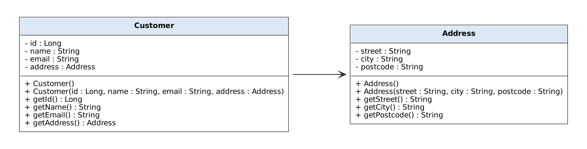
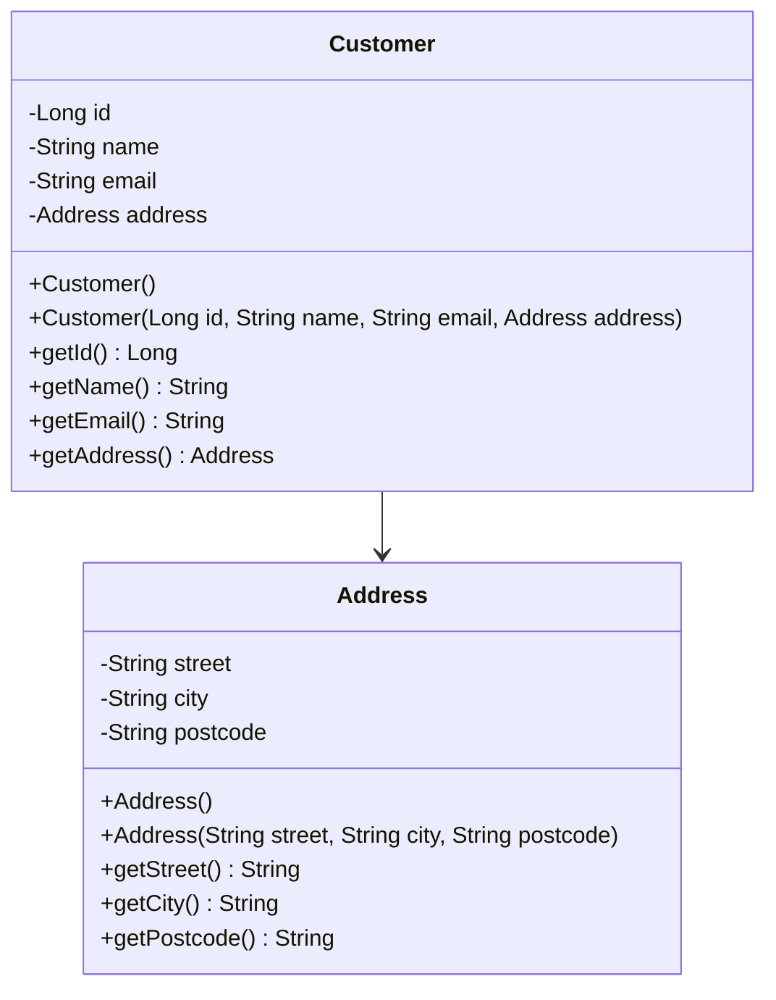

# Customer and Address — UML Class Diagram

A Customer **has an** Address (association, arrow points at Address).

```mermaid
classDiagram
    class Customer {
        -Long id
        -String name
        -String email
        -Address address
        +Customer()
        +Customer(Long id, String name, String email, Address address)
        +getId() Long
        +getName() String
        +getEmail() String
        +getAddress() Address
    }
    class Address {
        -String street
        -String city
        -String postcode
        +Address()
        +Address(String street, String city, String postcode)
        +getStreet() String
        +getCity() String
        +getPostcode() String
    }
    Customer --> Address
```
